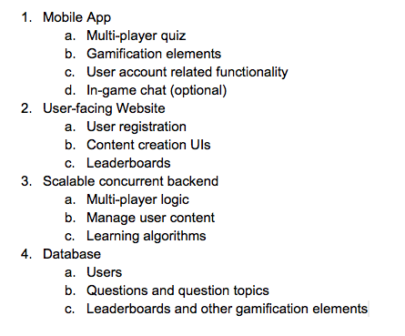

### Meeting 2

  __Date:__ September 14, 2016
  __Beginning time:__ 14:00
  __Ending time:__ 15:00
  __Location:__ ECS 668

#### Purpose:

#### Description:

1. Project Proposal:
   
  Since mobile devices are becoming much cheaper, more and younger students have them.  With a variety of entertainment available, it can be difficult for students to find the motivation to study. Traditional studying methods are boring; existing educational video games are generally repetitive and not very fun. There is too much focus on memorization over game play.

  The project we are proposing is a mobile app that employs “gamification” concepts (the application of game elements to other areas) and a heavy use of user interaction, for studying high school topics; combining a fun real-time experience with knowledge tests (multi-option  and/or short answer questions). By using gamification and (simulated) real time multiplayer interaction, our mobile app will promote competition and social interactivity. This can motivate students to learn by engaging other users and create a positive, social learning environment between students.

  Our product will have a strong focus on user interaction and gamification principles; it might even look like a simple videogame (although it isn’t). Ideally in the future, it would be able to easily “switch” the competition mechanics to appear as a different “videogame”. The user experience design will get inspiration from similar products that add gamification concepts (without relying on graphics) to the learning process, and introduce an “ad-hoc” multiplayer social element.

  Although we will provide a base of questions on general topics, users will be able to create their own question sets and publish them in a website for creating and sharing content. In the future, new users will be able to use content uploaded by other users. 

  Our mobile app will have three different modes: single player, two players and team mode. Each mode will have a player have to perform a key game function by providing an answer to a study question. The initial content will be exclusively English and Math material, but later (time permitting) will be improved by adding other general topics and user generated content.

2. Target Audience:
   
  Students currently enrolled in grades 10 to 12.  Peripherally, teachers will be able to add content for the students as well.

3. Proposed high-level architecture:
   
  These are the designed elements we think may be required for the project:

4. Slides link:
   
  [Game2study](https://docs.google.com/presentation/d/1aLj0N2cIrq-vMdi7pAXCdUXNZKhDUD2VXB9OHxMlqFE/edit?usp=sharing)
  

#### Outcome: Game2Study first draft

#### [Go back (Main)](https://github.com/TaniaFerman/SignTalker)

