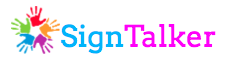

### Meeting 6

  __Date:__ September 28, 2016
  __Beginning time:__ 13:45
  __Ending time:__ 14:15
  __Location:__ Engineering Lab Wing

#### Purpose: SignTalker's users
#### Description: 

For the project we will need test users. For milestone 1 (Proof of Concept) we need users that can sign in a fluent way the American Sign Language Alphabet. Besides for an early stage we need videos of none-deaf people doing the first four letters of the alphabet in order to test the algorithm. For milestone 2 and 3 we will need deaf testers to have an accurate feedback of our tool.

As an alternative project. Our tool can be used for teaching ASL. In this case our users will be ASL students in Uvic. Therefore, they will be enrolled in American Sign Language I - 10184 or American Sign Language III - 10194. 

#### Outcome: Users description for final project and alternative project.

#### [Go back (Main)](https://github.com/TaniaFerman/SignTalker)

